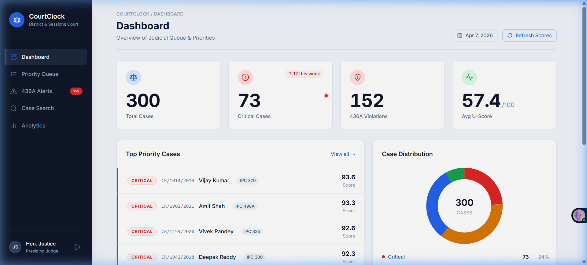
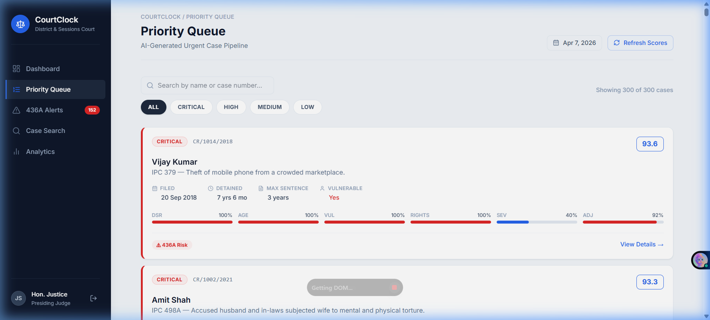
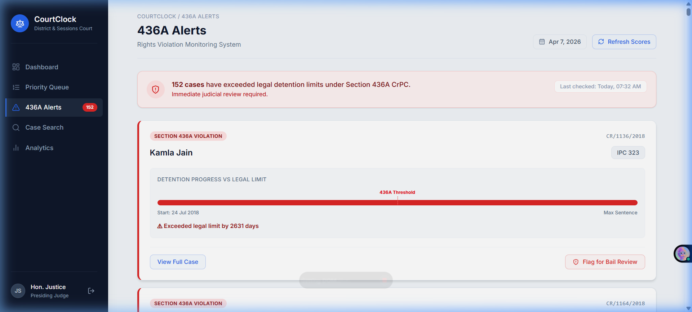
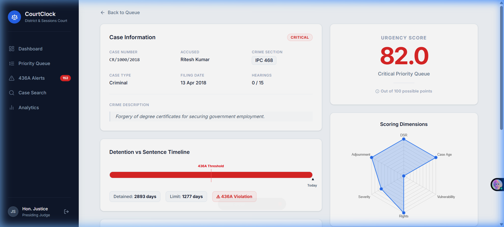
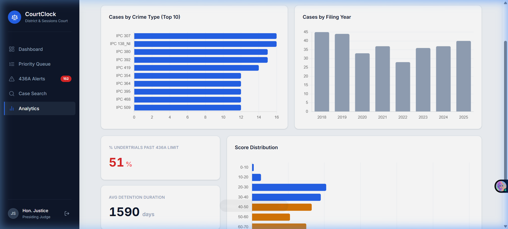
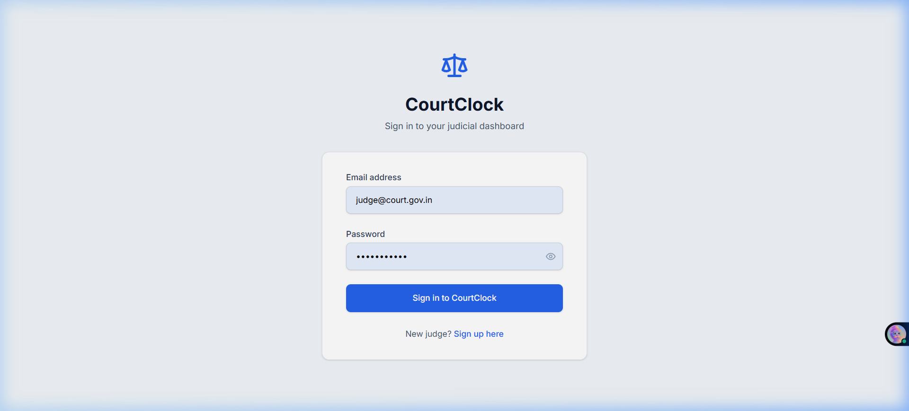

<div align="center">


<br/>

# CourtClock

**AI-Powered Court Case Prioritization System for the Indian Judiciary**

*Replacing first-in-first-out scheduling with urgency-based case ranking*

<br/>


<br/>



</div>

<br/>

## 💡 What is CourtClock?

India has **4.3 crore+ pending cases**. Courts process them by filing date — first in, first out. This means a person accused of a minor offence can sit in jail for years while newer cases are heard first.

**CourtClock** fixes this. It scores every case across **6 urgency dimensions** and presents judges with a ranked priority queue so the most critical cases get heard first.

It specifically monitors **Section 436A CrPC** — automatically flagging undertrials who've been detained beyond half their maximum sentence, a direct constitutional rights violation.

<br/>

## ✨ Features

- 🏛️ **U-Score Engine** — Composite urgency scoring (0–100) across 6 weighted factors
- 🚨 **436A Violation Alerts** — Automatic detection of illegal detention exceeding legal limits
- 🤖 **AI Case Analysis** — InLegalBERT NLP classification with rule-based fallback
- 📊 **Priority Queue** — Cases ranked by urgency, not filing date
- 🔄 **Before/After Toggle** — See how CourtClock reorders the same queue
- 📈 **Analytics Dashboard** — Crime type breakdown, filing trends, score distribution
- 🔍 **Smart Search** — Search across all fields with vulnerability & undertrial filters
- 🔐 **Judge Auth** — JWT login with bcrypt password hashing

<br/>

## 📸 Screenshots

| Dashboard | Priority Queue |
|:-:|:-:|
|  |  |

| 436A Alerts | Case Detail |
|:-:|:-:|
|  |  |

| Analytics | Login |
|:-:|:-:|
|  |  |

<br/>

## 🚀 Quick Start

### Prerequisites

- Python 3.10+
- Node.js 18+

### 1️⃣ Clone

```bash
git clone https://github.com/<your-username>/CourtClock.git
cd CourtClock
```

### 2️⃣ Backend

```bash
cd backend
python -m venv venv
venv\Scripts\activate          # Windows
# source venv/bin/activate     # macOS/Linux

pip install -r requirements.txt
python data_generator.py       # generates 300 synthetic cases
python seed_user.py            # creates default judge account
python app.py                  # starts API on http://localhost:5000
```

### 3️⃣ Frontend

```bash
cd frontend
npm install
npm run dev                    # starts UI on http://localhost:5173
```

### 4️⃣ Login

| | |
|---|---|
| **Email** | `judge@court.gov.in` |
| **Password** | `password123` |

<br/>

---

<br/>

## 🏗️ Architecture

```
┌───────────────────────────────────────────────────────┐
│                  FRONTEND  (React + Vite)              │
│                                                       │
│   Dashboard · Queue · Alerts · Search · Analytics     │
│                       │                               │
│               Axios HTTP Client                       │
└───────────────────────┬───────────────────────────────┘
                        │ REST API (JSON)
┌───────────────────────┴───────────────────────────────┐
│                  BACKEND  (Flask + Python)             │
│                                                       │
│   app.py ─── scoring_engine.py ─── nlp_module.py      │
│       │           │                     │             │
│       └───────────┴─────────────────────┘             │
│                       │                               │
│               SQLAlchemy ORM                          │
│                       │                               │
│               SQLite (courtclock.db)                  │
└───────────────────────────────────────────────────────┘
```

<br/>

## 📁 Project Structure

```
CourtClock/
│
├── backend/
│   ├── app.py                 # Flask API — auth, cases, alerts, AI endpoints
│   ├── database.py            # SQLAlchemy models (Case, User) + DB init
│   ├── scoring_engine.py      # U-Score calculator — the core algorithm
│   ├── nlp_module.py          # InLegalBERT classifier with rule-based fallback
│   ├── section_mapper.py      # IPC section → severity & sentence mapper
│   ├── data_generator.py      # Synthetic case generator (300 cases)
│   ├── seed_user.py           # Default judge account seeder
│   ├── requirements.txt       # Python dependencies
│   └── data/
│       └── ipc_sections.json  # 28 IPC sections with severity data
│
├── frontend/
│   ├── vite.config.js         # Vite + React + Tailwind config
│   ├── package.json
│   └── src/
│       ├── App.jsx            # Routes & auth guard
│       ├── index.css          # Design tokens & Tailwind theme
│       ├── utils.js           # Date/score formatting helpers
│       ├── api/api.js         # Axios API layer
│       ├── hooks/useCountUp.js
│       ├── components/        # Sidebar, StatCard, CaseCard, PriorityBadge, etc.
│       └── pages/             # Dashboard, Queue, Alerts, CaseDetail, Analytics,
│                              # Search, Login, Signup
│
└── screenshots/               # UI screenshots
```

<br/>

---

<br/>

## ⚙️ U-Score Engine — The Core Algorithm

Every case gets a **U-Score from 0 to 100** based on 6 weighted dimensions:

```
U-Score = (
    0.30 × DSR             ←  Detention-to-Sentence Ratio
  + 0.20 × Case Age        ←  Age vs. case-type benchmark
  + 0.15 × Vulnerability   ←  Elderly / minor / disabled flag
  + 0.20 × Rights          ←  Section 436A violation check
  + 0.10 × Severity        ←  Crime severity from IPC mapping
  + 0.05 × Adjournment     ←  Hearing miss rate
) × 100
```

### Dimension Breakdown

| # | Dimension | Weight | What it measures | Score |
|:-:|-----------|:------:|------------------|:-----:|
| 1 | **DSR** | 30% | How much of max sentence has been served in pre-trial detention | 0 – 1 |
| 2 | **Case Age** | 20% | How old the case is relative to benchmark for its type | 0 – 1 |
| 3 | **Vulnerability** | 15% | Whether the accused is elderly, a minor, disabled, or economically weak | 0 or 1 |
| 4 | **Rights (436A)** | 20% | Whether detention exceeds 50% of maximum sentence | 0 – 1 |
| 5 | **Severity** | 10% | Crime severity from IPC section classification | 0.2 – 1 |
| 6 | **Adjournment** | 5% | Ratio of missed hearings to scheduled hearings | 0 – 1 |

### Priority Mapping

| U-Score | Priority | Meaning |
|:-------:|:--------:|---------|
| ≥ 75 | 🔴 **CRITICAL** | Immediate judicial intervention required |
| 50 – 74 | 🟠 **HIGH** | Should be scheduled within days |
| 25 – 49 | 🔵 **MEDIUM** | Standard priority processing |
| < 25 | 🟢 **LOW** | Can follow normal queue order |

<br/>

---

<br/>

## 🚨 Section 436A CrPC

> *If an undertrial has been detained for **≥ 50% of their maximum sentence**, they must be released on personal bond.*

CourtClock automatically detects these violations:

1. **Calculates** `detention_days` vs `(max_sentence_years × 365) / 2`
2. **Flags** cases that exceed the threshold
3. **Alerts** judges with a dedicated violations dashboard
4. **Boosts** the case's U-Score via the 20% Rights dimension

The `/api/alerts/436a` endpoint returns all flagged cases sorted by severity.

<br/>

---

<br/>

## 🤖 AI / NLP Classification

The system uses a **dual-strategy** approach:

| Strategy | When | How |
|----------|------|-----|
| **InLegalBERT** | Transformer libs installed | HuggingFace pipeline with `law-ai/InLegalBERT` |
| **Rule-based** | Always (fallback) | Keyword matching across 8 crime categories |

### Classification Tags

`violent` · `sexual_offence` · `property` · `fraud` · `kidnapping` · `domestic_violence` · `threat_extortion` · `undertrial`

### AI Report Output

For each case, the system generates a structured 4-section analysis:

1. **U-Score Breakdown** — Score factors and severity classification
2. **Urgency Impact** — 436A risk and detention ratio
3. **Hearing Delays** — Adjournment abuse detection
4. **Recommendation** — Actionable judicial recommendation (bail hearing, priority scheduling, etc.)

<br/>

---

<br/>

## 🌐 API Reference

Base URL: `http://localhost:5000`

All responses use `{ "success": bool, "data": ... }` envelope.

### Auth

| Method | Route | Description |
|:------:|-------|-------------|
| `POST` | `/api/auth/judge-login` | Login → returns JWT |
| `POST` | `/api/auth/judge-signup` | Register new judge |

### Cases

| Method | Route | Description |
|:------:|-------|-------------|
| `GET` | `/api/cases` | All cases by filing date (FIFO) |
| `GET` | `/api/cases/priority` | All cases by U-Score (prioritized) |
| `GET` | `/api/cases/<id>` | Single case details |
| `POST` | `/api/cases/score-all` | Recalculate all U-Scores |

### Alerts & Stats

| Method | Route | Description |
|:------:|-------|-------------|
| `GET` | `/api/alerts/436a` | Cases exceeding 436A detention threshold |
| `GET` | `/api/stats` | Aggregate stats (counts, avg score, violations) |

### AI

| Method | Route | Description |
|:------:|-------|-------------|
| `POST` | `/api/ai/classify/<id>` | Run NLP classifier on a case |
| `GET` | `/api/ai/explain/<id>` | Get/generate AI analysis |

<br/>

---

<br/>

## 🗃️ Database Schema

SQLite database with two tables:

### `cases` — 30 columns

Core fields: `case_number`, `accused_name`, `crime_section`, `crime_description`, `filing_date`, `detention_start_date`, `max_sentence_years`, `hearing_count`, `hearings_held`, `vulnerability_flag`, `is_undertrial`, `case_type`

Score fields: `u_score`, `dsr_score`, `age_score`, `vulnerability_score`, `rights_score`, `severity_score`, `adjournment_score`, `priority_level`

AI fields: `ai_explanation`, `ai_tags`

### `users`

`email` (unique) · `password_hash` (bcrypt) · `role` (default: judge) · `created_at`

<br/>

---

<br/>

## 🎨 Frontend

### Pages

| Page | Route | What it does |
|------|:-----:|-------------|
| Login | `/login` | Email/password authentication |
| Signup | `/signup` | Judge registration |
| Dashboard | `/` | Stats, top cases, donut chart, violations, before/after toggle |
| Priority Queue | `/queue` | Full prioritized list with filters & search |
| 436A Alerts | `/alerts` | Detention violation cards with progress bars |
| Case Detail | `/case/:id` | Score breakdown, detention timeline, radar chart, AI analysis |
| Search | `/search` | Full-text search + vulnerability/undertrial filters |
| Analytics | `/analytics` | Crime type charts, filing trends, score distribution |

### Tech

- **React 18** + **Vite 5** + **Tailwind CSS 4**
- **Framer Motion** for staggered load animations
- **Chart.js** for doughnut, bar, and radar charts
- **Lucide React** for icons
- **Axios** for API calls
- Custom `useCountUp` hook for animated stat numbers

### Design System

```
Primary:    #0F172A  (dark navy)     Accent:   #2563EB  (blue)
Critical:   #DC2626  (red)           High:     #D97706  (amber)
Medium:     #2563EB  (blue)          Low:      #16A34A  (green)
Font:       Inter                    Cards:    White + border-slate-200 + rounded-xl
```

<br/>

---

<br/>

## 🎲 Synthetic Data

`data_generator.py` creates **300 reproducible** (`seed=42`) Indian court cases with:

- 65 realistic Indian names · 28 IPC sections · 15 district courts
- 2–3 crime description variants per section
- ~75% undertrial · ~20% vulnerable · 25% high adjournment rate
- Auto-scored with `compute_u_score()` during generation

<br/>

## 🔐 Auth Flow

```
Signup → bcrypt hash → DB
Login  → verify hash → JWT (24h expiry) → localStorage
App.jsx checks token → redirect to /login if missing
Logout → clear localStorage
```

<br/>

## 🔑 Environment Notes

Defaults are hardcoded for development. For production, externalize:

| Variable | Default |
|----------|---------|
| `JWT_SECRET` | `super_secret_jwt_key_courtclock` |
| `DATABASE_URI` | `sqlite:///courtclock.db` |
| `FLASK_DEBUG` | `True` |
| `API_BASE_URL` | `http://localhost:5000/api` |

<br/>

---

<br/>

## 🤝 Contributing

```bash
fork → git checkout -b feature/your-feature → commit → push → PR
```

- Backend auto-reloads in debug mode
- Frontend uses Vite HMR
- Reset DB: delete `courtclock.db` → `python data_generator.py`
- Add IPC sections: edit `backend/data/ipc_sections.json`

<br/>

## 📄 License

Open source under the [MIT License](LICENSE).

<br/>

---

<div align="center">

**Built for the Indian Judiciary** ⚖️

*Justice delayed is justice denied.*

</div>
